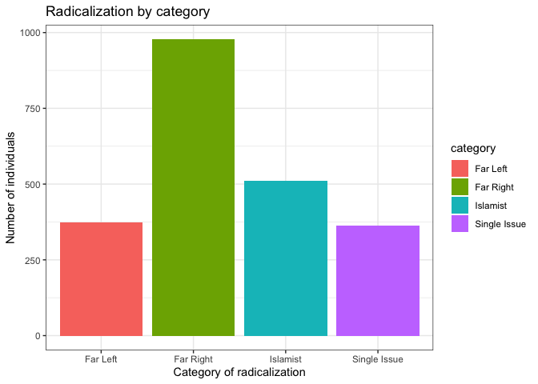

Portfolio 4
================

``` r
library(tidyverse)
```

    ## ── Attaching core tidyverse packages ──────────────────────── tidyverse 2.0.0 ──
    ## ✔ dplyr     1.1.0     ✔ readr     2.1.4
    ## ✔ forcats   1.0.0     ✔ stringr   1.5.0
    ## ✔ ggplot2   3.4.1     ✔ tibble    3.2.1
    ## ✔ lubridate 1.9.2     ✔ tidyr     1.3.0
    ## ✔ purrr     1.0.1     
    ## ── Conflicts ────────────────────────────────────────── tidyverse_conflicts() ──
    ## ✖ dplyr::filter() masks stats::filter()
    ## ✖ dplyr::lag()    masks stats::lag()
    ## ℹ Use the ]8;;http://conflicted.r-lib.org/conflicted package]8;; to force all conflicts to become errors

``` r
library(ggplot2)
```

``` r
# Load required packages
library(readxl)

# Read in the data
df <- read_excel("/Users/lindsaystall/Downloads/PIRUS_Public_May2020.xlsx")
```

    ## Warning: Expecting numeric in CI2 / R2C87: got a date

    ## Warning: Expecting numeric in CI3 / R3C87: got a date

    ## Warning: Expecting numeric in CI4 / R4C87: got a date

    ## Warning: Expecting numeric in CK9 / R9C89: got a date

    ## Warning: Expecting numeric in CK11 / R11C89: got a date

    ## Warning: Expecting numeric in CI16 / R16C87: got a date

    ## Warning: Expecting numeric in CI18 / R18C87: got a date

    ## Warning: Expecting numeric in CI24 / R24C87: got a date

    ## Warning: Expecting numeric in CI29 / R29C87: got a date

    ## Warning: Expecting numeric in CI30 / R30C87: got a date

    ## Warning: Expecting numeric in CK32 / R32C89: got a date

    ## Warning: Expecting numeric in CI36 / R36C87: got a date

    ## Warning: Expecting numeric in CI51 / R51C87: got a date

    ## Warning: Expecting numeric in CK57 / R57C89: got a date

    ## Warning: Expecting numeric in CI61 / R61C87: got a date

    ## Warning: Expecting numeric in CI62 / R62C87: got a date

    ## Warning: Expecting numeric in CI63 / R63C87: got a date

    ## Warning: Expecting numeric in CK72 / R72C89: got a date

    ## Warning: Expecting numeric in CI74 / R74C87: got a date

    ## Warning: Expecting numeric in CK81 / R81C89: got a date

    ## Warning: Expecting numeric in CK82 / R82C89: got a date

    ## Warning: Expecting numeric in CK84 / R84C89: got a date

    ## Warning: Expecting numeric in CK91 / R91C89: got a date

    ## Warning: Expecting numeric in CI94 / R94C87: got a date

    ## Warning: Expecting numeric in CI97 / R97C87: got a date

    ## Warning: Expecting numeric in CI98 / R98C87: got a date

    ## Warning: Expecting numeric in CK99 / R99C89: got a date

    ## Warning: Expecting numeric in CI100 / R100C87: got a date

    ## Warning: Expecting numeric in CI101 / R101C87: got a date

    ## Warning: Expecting numeric in CI102 / R102C87: got a date

    ## Warning: Expecting numeric in CK103 / R103C89: got a date

    ## Warning: Expecting numeric in CK106 / R106C89: got a date

    ## Warning: Expecting numeric in CK110 / R110C89: got a date

    ## Warning: Expecting numeric in CI113 / R113C87: got a date

    ## Warning: Expecting numeric in CI118 / R118C87: got a date

    ## Warning: Expecting numeric in CK120 / R120C89: got a date

    ## Warning: Expecting numeric in CK123 / R123C89: got a date

    ## Warning: Expecting numeric in CI124 / R124C87: got a date

    ## Warning: Expecting numeric in CK125 / R125C89: got a date

    ## Warning: Expecting numeric in CI126 / R126C87: got a date

    ## Warning: Expecting numeric in CI136 / R136C87: got a date

    ## Warning: Expecting numeric in CI143 / R143C87: got a date

    ## Warning: Expecting numeric in CK147 / R147C89: got a date

    ## Warning: Expecting numeric in CI158 / R158C87: got a date

    ## Warning: Expecting numeric in CI159 / R159C87: got a date

    ## Warning: Expecting numeric in CI160 / R160C87: got a date

    ## Warning: Expecting numeric in CI166 / R166C87: got a date

    ## Warning: Expecting numeric in CI169 / R169C87: got a date

    ## Warning: Expecting numeric in CI171 / R171C87: got a date

    ## Warning: Expecting numeric in CI173 / R173C87: got a date

    ## Warning: Expecting numeric in CI176 / R176C87: got a date

    ## Warning: Expecting numeric in CI177 / R177C87: got a date

    ## Warning: Expecting numeric in CK179 / R179C89: got a date

    ## Warning: Expecting numeric in CK181 / R181C89: got a date

    ## Warning: Expecting numeric in CK202 / R202C89: got a date

    ## Warning: Expecting numeric in CI208 / R208C87: got a date

    ## Warning: Expecting numeric in CK237 / R237C89: got a date

    ## Warning: Expecting numeric in CI277 / R277C87: got a date

    ## Warning: Expecting numeric in CK279 / R279C89: got a date

    ## Warning: Expecting numeric in CI296 / R296C87: got a date

    ## Warning: Expecting numeric in CK301 / R301C89: got a date

    ## Warning: Expecting numeric in CK302 / R302C89: got a date

    ## Warning: Expecting numeric in CI322 / R322C87: got a date

    ## Warning: Expecting numeric in CI337 / R337C87: got a date

    ## Warning: Expecting numeric in CK337 / R337C89: got a date

    ## Warning: Expecting numeric in CI357 / R357C87: got a date

    ## Warning: Expecting numeric in CK371 / R371C89: got a date

    ## Warning: Expecting numeric in CI375 / R375C87: got a date

    ## Warning: Expecting numeric in CI429 / R429C87: got a date

    ## Warning: Expecting numeric in CI541 / R541C87: got a date

    ## Warning: Expecting numeric in CI570 / R570C87: got a date

    ## Warning: Expecting numeric in CK570 / R570C89: got a date

    ## Warning: Expecting numeric in CI605 / R605C87: got a date

    ## Warning: Expecting numeric in CI620 / R620C87: got a date

    ## Warning: Expecting numeric in CI664 / R664C87: got a date

    ## Warning: Expecting numeric in CK664 / R664C89: got a date

    ## Warning: Expecting numeric in CI890 / R890C87: got a date

    ## Warning: Expecting numeric in CI896 / R896C87: got a date

    ## Warning: Expecting numeric in CI951 / R951C87: got a date

    ## Warning: Expecting numeric in CI957 / R957C87: got a date

    ## Warning: Expecting numeric in CI1029 / R1029C87: got a date

    ## Warning: Expecting numeric in CI1054 / R1054C87: got a date

    ## Warning: Expecting numeric in CK1067 / R1067C89: got a date

    ## Warning: Expecting numeric in CI1106 / R1106C87: got a date

    ## Warning: Expecting numeric in CI1133 / R1133C87: got a date

    ## Warning: Expecting numeric in CI1253 / R1253C87: got a date

    ## Warning: Expecting numeric in CI1260 / R1260C87: got a date

    ## Warning: Expecting numeric in CK1260 / R1260C89: got a date

    ## Warning: Expecting numeric in EJ1338 / R1338C140: got 'Age: 15'

    ## Warning: Expecting numeric in CI1438 / R1438C87: got a date

    ## Warning: Expecting numeric in CI1439 / R1439C87: got a date

    ## Warning: Expecting numeric in CI1440 / R1440C87: got a date

    ## Warning: Expecting numeric in CI1441 / R1441C87: got a date

    ## Warning: Expecting numeric in CI1484 / R1484C87: got a date

    ## Warning: Expecting numeric in CI1486 / R1486C87: got a date

    ## Warning: Expecting numeric in CI1487 / R1487C87: got a date

    ## Warning: Expecting numeric in CI1493 / R1493C87: got a date

    ## Warning: Expecting numeric in CI1495 / R1495C87: got a date

    ## Warning: Expecting numeric in CI1499 / R1499C87: got a date

    ## Warning: Expecting numeric in CI1502 / R1502C87: got a date

    ## Warning: Expecting numeric in CI1504 / R1504C87: got a date

    ## Warning: Expecting numeric in CI1506 / R1506C87: got a date

    ## Warning: Expecting numeric in CI1513 / R1513C87: got a date

    ## Warning: Expecting numeric in CI1515 / R1515C87: got a date

    ## Warning: Expecting numeric in CI1521 / R1521C87: got a date

    ## Warning: Expecting numeric in CK1521 / R1521C89: got a date

    ## Warning: Expecting numeric in CI1527 / R1527C87: got a date

    ## Warning: Expecting numeric in CK1529 / R1529C89: got a date

    ## Warning: Expecting numeric in CI1533 / R1533C87: got a date

    ## Warning: Expecting numeric in CK1535 / R1535C89: got a date

    ## Warning: Coercing text to numeric in CK1540 / R1540C89: '-88'

    ## Warning: Expecting numeric in CK1546 / R1546C89: got a date

    ## Warning: Expecting numeric in CK1549 / R1549C89: got a date

    ## Warning: Expecting numeric in CK1550 / R1550C89: got a date

    ## Warning: Expecting numeric in CI1553 / R1553C87: got a date

    ## Warning: Expecting numeric in CI1558 / R1558C87: got a date

    ## Warning: Expecting numeric in CI1559 / R1559C87: got a date

    ## Warning: Expecting numeric in CI1560 / R1560C87: got a date

    ## Warning: Expecting numeric in CK1577 / R1577C89: got a date

    ## Warning: Expecting numeric in CI1578 / R1578C87: got a date

    ## Warning: Expecting numeric in CK1579 / R1579C89: got a date

    ## Warning: Expecting numeric in CI1593 / R1593C87: got a date

    ## Warning: Expecting numeric in CK1595 / R1595C89: got a date

    ## Warning: Expecting numeric in CK1597 / R1597C89: got a date

    ## Warning: Expecting numeric in CI1598 / R1598C87: got a date

    ## Warning: Expecting numeric in CK1604 / R1604C89: got a date

    ## Warning: Expecting numeric in CI1606 / R1606C87: got a date

    ## Warning: Expecting numeric in CI1607 / R1607C87: got a date

    ## Warning: Expecting numeric in CI1609 / R1609C87: got a date

    ## Warning: Expecting numeric in CI1618 / R1618C87: got a date

    ## Warning: Expecting numeric in CI1619 / R1619C87: got a date

    ## Warning: Expecting numeric in CK1620 / R1620C89: got a date

    ## Warning: Expecting numeric in CK1621 / R1621C89: got a date

    ## Warning: Expecting numeric in CI1643 / R1643C87: got a date

    ## Warning: Expecting numeric in CK1645 / R1645C89: got a date

    ## Warning: Coercing text to numeric in CK1661 / R1661C89: '-88'

    ## Warning: Expecting numeric in CI1676 / R1676C87: got a date

    ## Warning: Expecting numeric in CI1679 / R1679C87: got a date

    ## Warning: Expecting numeric in CK1681 / R1681C89: got a date

    ## Warning: Expecting numeric in CK1685 / R1685C89: got a date

    ## Warning: Expecting numeric in CI1693 / R1693C87: got a date

    ## Warning: Expecting numeric in CK1713 / R1713C89: got a date

    ## Warning: Expecting numeric in CI1716 / R1716C87: got a date

    ## Warning: Expecting numeric in CK1718 / R1718C89: got a date

    ## Warning: Expecting numeric in CK1719 / R1719C89: got a date

    ## Warning: Expecting numeric in CI1720 / R1720C87: got a date

    ## Warning: Expecting numeric in CK1731 / R1731C89: got a date

    ## Warning: Expecting numeric in CK1738 / R1738C89: got a date

    ## Warning: Expecting numeric in CI1741 / R1741C87: got a date

    ## Warning: Expecting numeric in CK1742 / R1742C89: got a date

    ## Warning: Expecting numeric in CK1743 / R1743C89: got a date

    ## Warning: Expecting numeric in CK1749 / R1749C89: got a date

    ## Warning: Expecting numeric in CI1752 / R1752C87: got a date

    ## Warning: Expecting numeric in CK1752 / R1752C89: got a date

    ## Warning: Expecting numeric in CI1753 / R1753C87: got a date

    ## Warning: Expecting numeric in CI1755 / R1755C87: got a date

    ## Warning: Expecting numeric in CI1764 / R1764C87: got a date

    ## Warning: Expecting numeric in CK1764 / R1764C89: got a date

    ## Warning: Expecting numeric in CK1793 / R1793C89: got a date

    ## Warning: Expecting numeric in CK1795 / R1795C89: got a date

    ## Warning: Expecting numeric in CK1796 / R1796C89: got a date

    ## Warning: Expecting numeric in CI1806 / R1806C87: got a date

    ## Warning: Expecting numeric in CI1807 / R1807C87: got a date

    ## Warning: Expecting numeric in CK1815 / R1815C89: got a date

    ## Warning: Expecting numeric in CI1825 / R1825C87: got a date

    ## Warning: Expecting numeric in CI1848 / R1848C87: got a date

    ## Warning: Expecting numeric in CI1850 / R1850C87: got a date

    ## Warning: Expecting numeric in CI1862 / R1862C87: got a date

    ## Warning: Expecting numeric in CI1907 / R1907C87: got a date

    ## Warning: Expecting numeric in CI1930 / R1930C87: got a date

    ## Warning: Expecting numeric in CI2005 / R2005C87: got a date

    ## Warning: Expecting numeric in BK2042 / R2042C63: got 'Maryland'

    ## Warning: Expecting numeric in CI2044 / R2044C87: got a date

    ## Warning: Expecting numeric in CK2091 / R2091C89: got a date

    ## Warning: Expecting numeric in CI2108 / R2108C87: got a date

    ## Warning: Expecting numeric in CI2109 / R2109C87: got a date

    ## Warning: Expecting numeric in CK2113 / R2113C89: got a date

    ## Warning: Expecting numeric in CI2123 / R2123C87: got a date

    ## Warning: Expecting numeric in CI2125 / R2125C87: got a date

    ## Warning: Expecting numeric in CK2127 / R2127C89: got a date

    ## Warning: Expecting numeric in CK2129 / R2129C89: got a date

    ## Warning: Expecting numeric in CI2135 / R2135C87: got a date

    ## Warning: Expecting numeric in CI2137 / R2137C87: got a date

    ## Warning: Expecting numeric in CI2144 / R2144C87: got a date

    ## Warning: Expecting numeric in CI2168 / R2168C87: got a date

    ## Warning: Expecting numeric in CK2168 / R2168C89: got a date

    ## Warning: Expecting numeric in CI2195 / R2195C87: got a date

    ## Warning: Expecting numeric in CI2206 / R2206C87: got a date

    ## Warning: Expecting numeric in CI2226 / R2226C87: got a date

``` r
count <- sum(df$Radicalization_Far_Right == 1)

cat("Number of individuals in Radicalization_Far_Right out of 2226 total terrorists:", count)
```

    ## Number of individuals in Radicalization_Far_Right out of 2226 total terrorists: 977

``` r
count <- sum(df$Radicalization_Far_Left == 1)

cat("Number of individuals in Radicalization_Far_Left out of 2226 total terrorists:", count)
```

    ## Number of individuals in Radicalization_Far_Left out of 2226 total terrorists: 374

``` r
count <- sum(df$Radicalization_Single_Issue == 1)

cat("Number of individuals in Radicalization_Single_Issue out of 2226 total terrorists:", count)
```

    ## Number of individuals in Radicalization_Single_Issue out of 2226 total terrorists: 364

``` r
count <- sum(df$Radicalization_Islamist == 1)

cat("Number of individuals in Radicalization_Islamist out of 2226 total terrorists:", count)
```

    ## Number of individuals in Radicalization_Islamist out of 2226 total terrorists: 511

``` r
counts <- c(
  sum(df$Radicalization_Far_Right == 1),
  sum(df$Radicalization_Far_Left == 1),
  sum(df$Radicalization_Single_Issue ==1),
  sum(df$Radicalization_Islamist ==1))

plot_df <- data.frame(
  category = c("Far Right", "Far Left", "Single Issue", "Islamist"),
  count = counts
)

ggplot(plot_df, aes(x = category, y = count, fill = category)) +
  geom_bar(stat = "identity") +
  labs(x = "Category of radicalization", y = "Number of individuals", title = "Radicalization by category") +
  theme_bw()
```

<!-- -->
